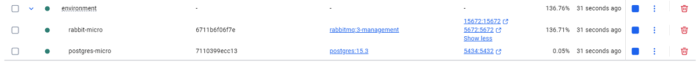
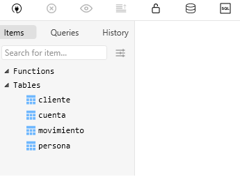

# OBTENER DESCARGABLES

```
    https://github.com/MLahuasi/reto-senior-ntt-data.git
```

# DISTRIBUCION ENTREGABLES

El reto contiene los siguientes directorios:

```
└─ cliente-service
└─ cuenta-service
└─ environment
```

Donde:

- environment: Genera un contenedor con la BDD Postgres y Rabbit (Operaciones Async entre microservicios). Además crea tablas mediante archivo BaseDatos.sql
- cliente-service: Fuentes microservicio #1

```
cliente-service/
├── pom.xml *
├── Dockerfile (pendiente)
├── .dockerignore (pendiente)
├── src/
│   ├── main/
│   │   ├── java/com/jmlq/cliente_service/
│   │   │   ├── controller/
│   │   │   │   └── ClienteController.java (pendiente)
│   │   │   ├── dto/
│   │   │   │   ├── ClienteCreateDTO.java *
│   │   │   │   ├── ClienteDeleteDTO.java *
│   │   │   │   ├── ClienteReadDTO.java *
│   │   │   │   ├── ClienteResponseDTO.java *
│   │   │   │   ├── ClienteUpdateDTO.java *
│   │   │   │   ├── PersonaDTO.java *
│   │   │   ├── mapper/
│   │   │   │   └── ClienteMapper.java *
│   │   │   ├── model/
│   │   │   │   ├── Cliente.java *
│   │   │   │   └── Persona.java *
│   │   │   ├── repository/
│   │   │   │   └── ClienteRepository.java *
│   │   │   ├── service/
│   │   │   │   ├── ClienteService.java (pendiente)
│   │   │   │   └── impl/
│   │   │   │       └── ClienteServiceImpl.java (pendiente)
│   │   │   ├── event/
│   │   │   │   ├── ClienteCreated.java (pendiente)
│   │   │   │   ├── ClienteRead.java (pendiente)
│   │   │   │   ├── ClienteUpdate.java (pendiente)
│   │   │   │   └── ClienteDelete.java (pendiente)
│   │   │   └── config/
│   │   │       ├── RabbitConfig.java (pendiente)
│   │   │       └── SwaggerConfig.java (opcional, pendiente)
│   │   └── resources/
│   │       └── application.yml *
│   └── test/
│       └── java/com/jmlq/cliente_service/
│           ├── service/ClienteServiceTest.java (pendiente)
│           └── controller/ClienteControllerTest.java (pendiente)
└── README.md (pendiente documentación de uso)

```

> cuenta-service: Fuentes microservicio #2

```

cuenta-service/
├── pom.xml *
├── Dockerfile (pendiente)
├── .dockerignore (pendiente)
├── src/
│   ├── main/
│   │   ├── java/com/jmlq/cuenta_service/
│   │   │   ├── controller/
│   │   │   │   └── CuentaController.java (pendiente)
│   │   │   ├── dto/
│   │   │   │   ├── CuentaCreateDTO.java *
│   │   │   │   ├── CuentaDeleteDTO.java *
│   │   │   │   ├── CuentaReadDTO.java *
│   │   │   │   ├── CuentaResponseDTO.java *
│   │   │   │   ├── CuentaUpdateDTO.java *
│   │   │   │   ├── MovimientoCreateDTO.java *
│   │   │   │   ├── MovimientoDeleteDTO.java *
│   │   │   │   ├── MovimientoReadDTO.java *
│   │   │   │   └── MovimientoResponseDTO.java *
│   │   │   │   ├── MovimientoUpdateDTO.java *
│   │   │   ├── mapper/
│   │   │   │   ├── CuentaMapper.java *
│   │   │   │   └── MovimientoMapper.java *
│   │   │   ├── model/
│   │   │   │   ├── Cuenta.java *
│   │   │   │   └── Movimiento.java *
│   │   │   ├── repository/
│   │   │   │   ├── CuentaRepository.java *
│   │   │   │   └── MovimientoRepository.java *
│   │   │   ├── service/
│   │   │   │   ├── CuentaService.java (pendiente)
│   │   │   │   ├── MovimientoService.java (pendiente)
│   │   │   │   └── impl/
│   │   │   │       ├── CuentaServiceImpl.java (pendiente)
│   │   │   │       └── MovimientoServiceImpl.java (pendiente)
│   │   │   ├── event/
│   │   │   │   ├── CuentaCreated.java (pendiente)
│   │   │   │   ├── CuentaRead.java (pendiente)
│   │   │   │   ├── CuentaUpdate.java (pendiente)
│   │   │   │   ├── CuentaDelete.java (pendiente)
│   │   │   │   ├── MovimientoCreated.java (pendiente)
│   │   │   │   ├── MovimientoRead.java (pendiente)
│   │   │   │   ├── MovimientoUpdate.java (pendiente)
│   │   │   │   └── MovimientoDelete.java (pendiente)
│   │   │   └── config/
│   │   │       ├── RabbitConfig.java (pendiente)
│   │   │       └── SwaggerConfig.java (opcional, pendiente)
│   │   └── resources/
│   │       └── application.yml *
│   └── test/
│       └── java/com/jmlq/cuenta_service/
│           ├── service/CuentaServiceTest.java (pendiente)
│           └── controller/CuentaControllerTest.java (pendiente)
└── README.md (pendiente documentación de uso)

```

## Levantar Imagen Docker BDD y Rabbit

1. Ingresar al directorio [environment](./environment/)
2. Ejecutar el comando:

```
    docker compose up -d
```

3. Se crea contenedor `Docker` con imagenes: `Postgres` y `Rabbit`

   

4. Además se crean las tablas en la BDD

   

# MEMO

- Ejecutar Proyecto

```
mvn clean spring-boot:run

```
