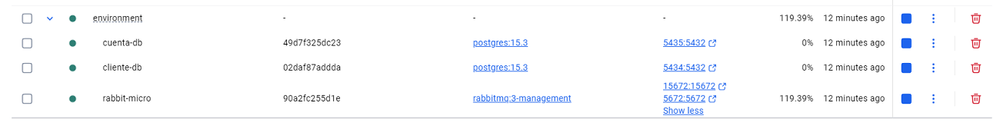
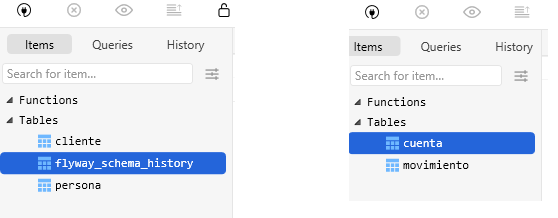

# OBTENER DESCARGABLES

```
    https://github.com/MLahuasi/reto-senior-ntt-data.git
```

# DISTRIBUCION ENTREGABLES

El reto contiene los siguientes directorios:

```
└─ cliente-service
└─ cuenta-service
└─ environment
```

Donde:

    - environment: Genera un contenedor con la BDD Postgres y Rabbit (Operaciones Async entre microservicios). Además crea tablas mediante archivo BaseDatos.sql
    - cliente-service: Fuentes microservicio #1
    - cuenta-service: Fuentes microservicio #2

## Levantar Imagen Docker BDD y Rabbit

1. Ingresar al directorio [environment](./environment/)
2. Ejecutar el comando:

```
    docker compose up -d
```

3. Se crea contenedor `Docker` con imagenes: `Postgres` y `Rabbit`

   

4. Además se crean las tablas en la BDD

   

# MEMO

- Ejecutar Proyecto

```
mvn clean spring-boot:run

```
