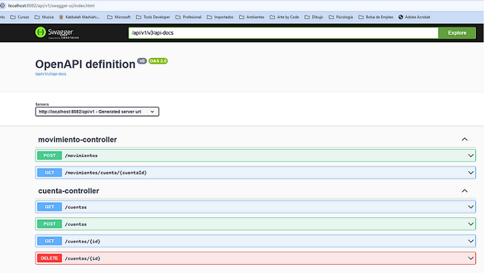
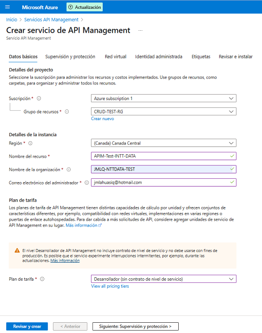
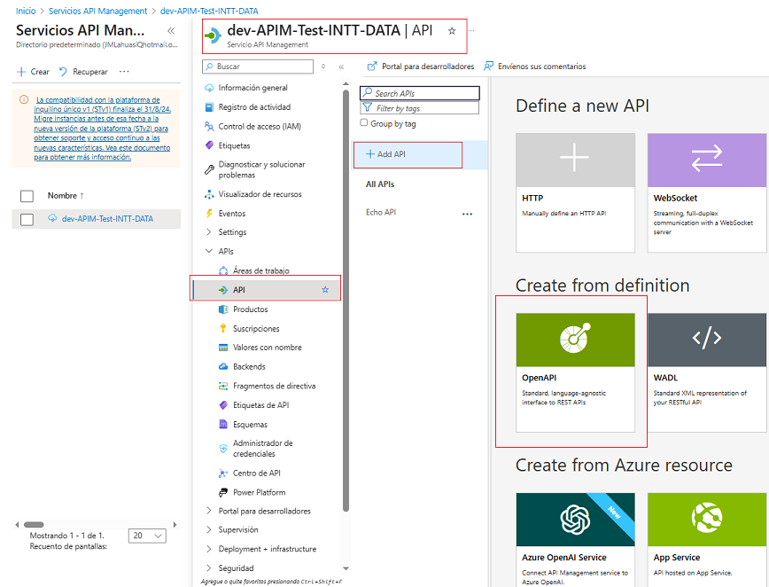
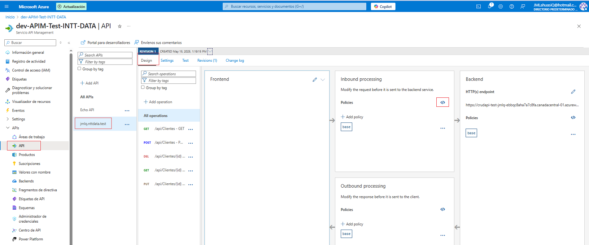
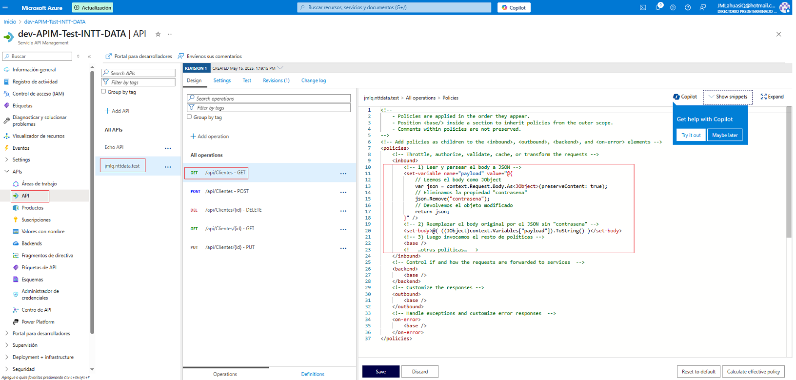
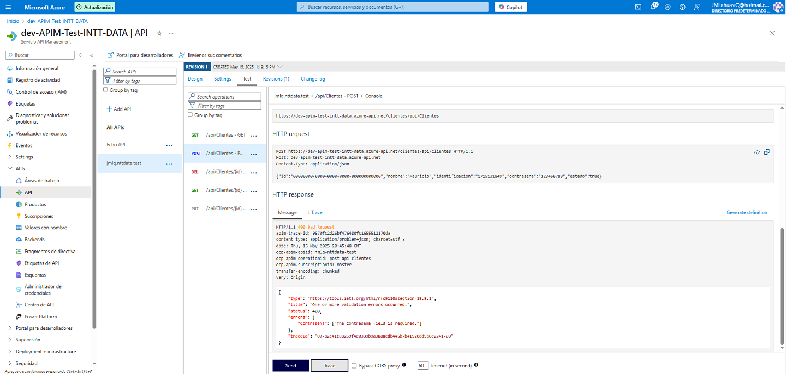
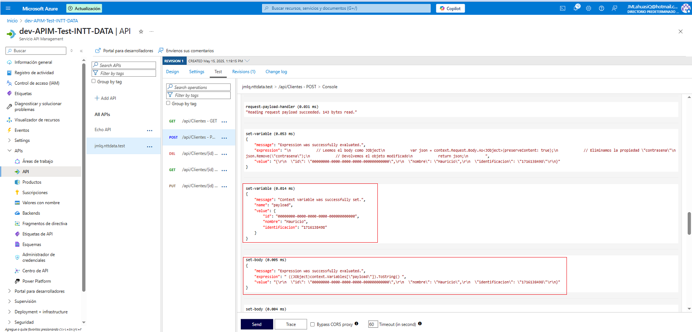
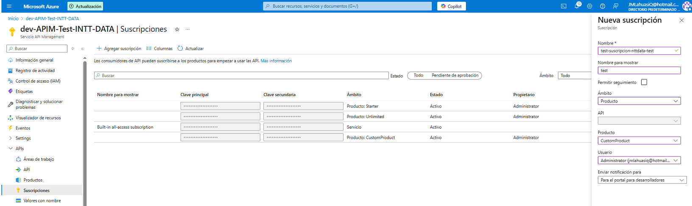
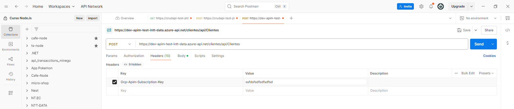
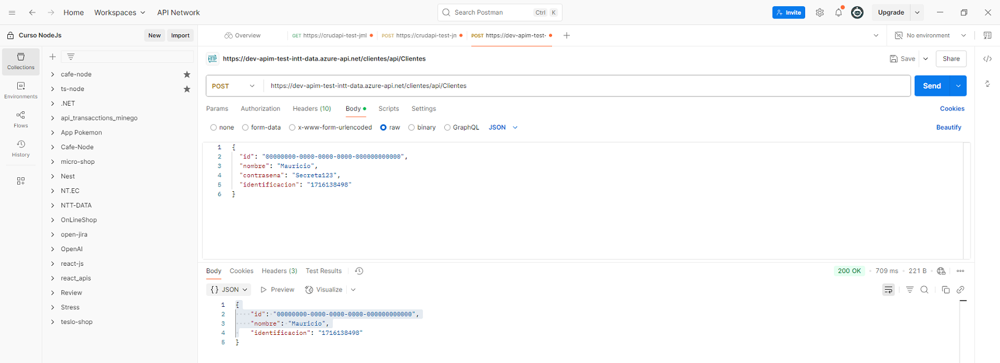

# OBTENER DESCARGABLES

```
    https://github.com/MLahuasi/reto-senior-ntt-data.git
```

# AMBIENTE

1. Se desarrollo con la version de Java

```
    openjdk 20.0.2 2023-07-18
    OpenJDK Runtime Environment (build 20.0.2+9-78)
    OpenJDK 64-Bit Server VM (build 20.0.2+9-78, mixed mode, sharing)
```

2. El IDE de desarrollo fue VSCode. **NOTA**: Visual Studio Code permitió usar la versión 17 (revisar archivos pom.xml)

# DISTRIBUCION ENTREGABLES

El reto contiene los siguientes directorios:

```
└─ cliente-service
└─ cuenta-service
└─ environment
```

## EJECUTAR PROYECTOS

#### [Ejecutar cliente-service](./cliente-service/README.md)

#### [Ejecutar cuenta-service](./cuenta-service/README.md)

# FUNCIONES

## COMUNICACION ASYNC

Como no se especificó en el documento técnico como debía ser implementado el proceso `async` usando `Rabbit`, se implementó lo siguiente:

Cuando se crea un `Cliente` (cliente-service) envía `ClienteId`, `NumeoCuenta`, `SaldoInicial`, `TipoCuenta` hacia `Cuenta` (cuenta-service) mendiante `Rabbit`.

```
                                     Rabbit


                                    ClienteId
                                    NumeoCuenta
                                    SaldoInicial
                                    TipoCuenta
             Cliente (Create)   ------------------>   Cuenta

```

Ejecutar:

**POST**

```
    http://localhost:8081/api/v1/clientes
```

## F1 CRUD

Se adjunta [**EndPoints Postman**](./assets/NTT-DATA.postman_collection.json)

## F2 y F3 (Registro de movimientos y Alerta “Saldo no disponible”)

**POST**

```
    http://localhost:8082/api/v1/movimientos
```


## F4 (Reportes: Generar un reporte de “Estado de cuenta” especificando un rango de fechas y cliente.)

**GET**

```
    http://localhost:8082/api/v1/reportes/estado-cuenta?clienteId=18&fechaIni=2025-05-10&fechaFin=2025-05-11
```


## F5 - Pruebas unitarias: Implementar 1 prueba unitaria para la entidad de dominio Cliente

[ClienteTest](./cliente-service/src/test/java/com/jmlq/cliente_service/model/ClienteTest.java)


## F6 - Pruebas de Integración: Implementar 1 prueba de integración

[](./cliente-service/src/test/java/com/jmlq/cliente_service/ClienteIntegrationTest.java)


## F7: Despliegue de la solución en contenedores

### Levantar Imagen Docker BDD y Rabbit

1. Ingresar al directorio [environment](./environment/)
2. Ejecutar el comando:

```
    docker-compose up --build -d

    NOTA: Una vez que finaliza el proceso de creación se debe esperar unos minutos hasta que se levanten bien los servicios.
```

3. Se crea contenedor `Docker` con subconedores: `2 Postgres`, `1 Rabbit`, `Cliente-Service` y `Cuenta-Service`

   

   **NOTA**: Considerar los puertos que usan los contenedores, se los configura en [docker-compose](./environment/docker-compose.yml).

4. Además se crean las tablas en la BDD

   

   **NOTA**: Para ingresar a las bdd usar las credenciales registradas en el archivo [docker-compose](./environment/docker-compose.yml).

## F8 - Realizar la documentación con Swagger mediante OpenAPI

**NOTA**: Se presentó alguna incompatiblidad con la dependencia que produce un error que se expone con el contról centralizado de Exceptions [GlobalExceptionHandler](./cliente-service/src/main/java/com/jmlq/cliente_service/exception/GlobalExceptionHandler.java).

```
    <dependency>
      <groupId>org.springdoc</groupId>
      <artifactId>springdoc-openapi-starter-webmvc-ui</artifactId>
      <version>2.0.2</version>
    </dependency>
```

La clase `GlobalExceptionHandler` también permite capturar las excepciones que se generan en las validaciones de los DTOs, por lo que opté por controlar la exception que se produce con Swagger y no sacrificar la visualización de mensajes de error personalizado.

### SWAGGER sin control de Exceptions

**Cliente-Service**: http://localhost:8081/api/v1/swagger-ui.html


**Cuenta-Service**: http://localhost:8082/api/v1/swagger-ui.html



### SWAGGER con control de Exceptions

**Cliente-Service**: http://localhost:8081/api/v1/swagger-ui.html


**Cuenta-Service**: http://localhost:8082/api/v1/swagger-ui.html


## F9 - F10 - F11 - Subir Crud App en Azure con Swagger

> - [Crear AppWeb en Azure](./cloud/README.md)

```
https://crudapi-test-jmlq-ebbqc8aha7a7c8fa.canadacentral-01.azurewebsites.net/swagger/index.html
```

## F10 - CREAR APIM

### Configurar APIM:



> - Se está implementando APIM:


> - VSCode instalar si no se encuentra instalado:

```
        Swashbuckle.AspNetCore
```

> - Guardar el contenido en un archivo openapi.json (o [.yaml](./assets/openapi.yaml))

### Importar especificación en Azure API Management

> - Dentro de `Servicios API Management` -> menú lateral APIs -> botón add API.



> - Seleccionar `OpenAPI`.

> - En `OpenAPI specification` elegir `OpenAPI file` y subir el [`openapi.json`](./assets/openapi.json) o `openapi.yaml`

> - Completar:

```
Display name: Clientes-CRUD

Name (API ID): clientes-crud

Web service URL: https://crudapi-test-jmlq-ebbqc8aha7a7c8fa.canadacentral-01.azurewebsites.net

API URL suffix: clientes
```


> - Dar clic en `Crear`. Azure generará automáticamente todas las operaciones (GET, POST, PUT, DELETE).


> - Validar api en Postman. `GET:` `https://crudapi-test-jmlq-ebbqc8aha7a7c8fa.canadacentral-01.azurewebsites.net/api/clientes`


## F12: Añadir autenticación por suscripción de APIM

> - En el portal de Azure ve a tu API Management → menú lateral Productos


> - Seleccionar (o crear) un producto, por ejemplo Starter o Standard.

> > - **Crear Nuevo**


> > - **Usar Started**

> - Marcar la casilla “Requiere suscripción” (Require subscription).

> - En la sección APIs, añade tu API clientes-crud.

> - Guarda los cambios.

## F13: Mediante Políticas Inbound y Outbound de APIM eliminar un campo a elección de la trama original de Request.

> - Abrir la configuración de políticas del API en: API Management > APIs, seleccionar API (clientes-crud) y dar clic en Design.



> - Pegar configuración:

```
<inbound>
    <!-- 1) Leer y parsear el body a JSON -->
    <set-variable name="payload" value='@{
        // Leemos el body como JObject
        var json = context.Request.Body.As<JObject>(preserveContent: true);
        // Eliminamos la propiedad "contrasena"
        json.Remove("contrasena");
        // Devolvemos el objeto modificado
        return json;
    }' />

    <!-- 2) Reemplazar el body original por el JSON sin "contrasena" -->
    <set-body>@( ((JObject)context.Variables["payload"]).ToString() )</set-body>

    <!-- 3) Luego invocamos el resto de políticas -->
    <base />
    <!-- …otras políticas… -->

```

**Donde**:

> > - `set-variable` lee el cuerpo como un objeto JObject.
> > - El segundo `set-variable` quita la clave "contrasena".
> > - `set-body` vuelve a escribir el JSON sin ese campo.



> - Resultado edición regla:


> - Trace






> - **Validar desde Postman**

Se usar url **APIM**: https://dev-apim-test-intt-data.azure-api.net/clientes/api/Clientes

> > - Validar Suscripcion


> > - Crear Suscripcion en Azure



> > - Enviar keys suscripcion en Postman



> > - Validar eliminar campo


