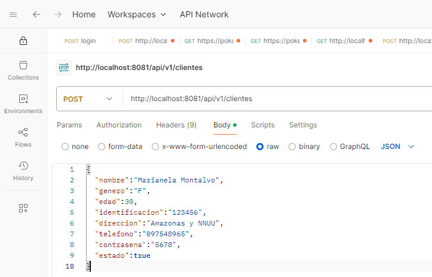

# OBTENER DESCARGABLES

```
    https://github.com/MLahuasi/reto-senior-ntt-data.git
```

# AMBIENTE

1. Se desarrollo con la version de Java

```
    openjdk 20.0.2 2023-07-18
    OpenJDK Runtime Environment (build 20.0.2+9-78)
    OpenJDK 64-Bit Server VM (build 20.0.2+9-78, mixed mode, sharing)
```

2. El IDE de desarrollo fue VSCode. **NOTA**: Visual Studio Code permitió usar la versión 17 (revisar archivos pom.xml)

# DISTRIBUCION ENTREGABLES

El reto contiene los siguientes directorios:

```
└─ cliente-service
└─ cuenta-service
└─ environment
```

Donde:

- environment: Genera un contenedor con la BDD Postgres y Rabbit (Operaciones Async entre microservicios). Además crea tablas mediante archivo BaseDatos.sql
- cliente-service: Fuentes microservicio #1

```
cliente-service/
├── pom.xml *
├── Dockerfile (p)
├── .dockerignore (p)
├── src/
│   ├── main/
│   │   ├── java/com/jmlq/cliente_service/
│   │   │   ├── controller/
│   │   │   │   └── ClienteController.java *
│   │   │   ├── dto/
│   │   │   │   ├── ClienteCreateDTO.java *
│   │   │   │   ├── ClienteDeleteDTO.java *
│   │   │   │   ├── ClienteReadDTO.java *
│   │   │   │   ├── ClienteResponseDTO.java *
│   │   │   │   └── ClienteUpdateDTO.java *
│   │   │   ├── mapper/
│   │   │   │   └── ClienteMapper.java *
│   │   │   ├── model/
│   │   │   │   ├── Persona.java *
│   │   │   │   └── Cliente.java *
│   │   │   ├── repository/
│   │   │   │   └── ClienteRepository.java *
│   │   │   ├── service/
│   │   │   │   ├── ClienteService.java *
│   │   │   │   └── impl/
│   │   │   │       └── ClienteServiceImpl.java *
│   │   │   ├── config/
│   │   │   │   └── RabbitConfig.java (p)
│   │   │   └── event/
│   │   │       └── ClienteCreatedEvent.java (p)
│   ├── test/
│   │   └── java/com/jmlq/cliente_service/
│   │       ├── ClienteServiceTest.java (p)
│   │       └── ClienteControllerTest.java (p)
│   └── resources/
│       ├── application.yml *
│       └── application-test.yml (p)
└── README.md (p)
```

> cuenta-service: Fuentes microservicio #2

```

cuenta-service/
├── pom.xml *
├── Dockerfile (p)
├── .dockerignore (p)
├── src/
│   ├── main/
│   │   ├── java/com/jmlq/cuenta_service/
│   │   │   ├── controller/
│   │   │   │   └── CuentaController.java (p)
│   │   │   ├── dto/
│   │   │   │   ├── CuentaCreateDTO.java *
│   │   │   │   ├── CuentaReadDTO.java *
│   │   │   │   ├── MovimientoCreateDTO.java *
│   │   │   │   └── MovimientoReadDTO.java *
│   │   │   ├── mapper/
│   │   │   │   ├── CuentaMapper.java *
│   │   │   │   └── MovimientoMapper.java *
│   │   │   ├── model/
│   │   │   │   ├── Cuenta.java *
│   │   │   │   └── Movimiento.java *
│   │   │   ├── repository/
│   │   │   │   ├── CuentaRepository.java *
│   │   │   │   └── MovimientoRepository.java *
│   │   │   ├── service/
│   │   │   │   ├── CuentaService.java (p)
│   │   │   │   ├── MovimientoService.java (p)
│   │   │   │   └── impl/
│   │   │   │       ├── CuentaServiceImpl.java (p)
│   │   │   │       └── MovimientoServiceImpl.java (p)
│   │   │   ├── config/
│   │   │   │   └── RabbitConfig.java (p)
│   │   │   └── event/
│   │   │       ├── CuentaCreatedEvent.java (p)
│   │   │       └── MovimientoCreatedEvent.java (p)
│   ├── test/
│   │   └── java/com/jmlq/cuenta_service/
│   │       ├── CuentaServiceTest.java (p)
│   │       └── CuentaControllerTest.java (p)
│   └── resources/
│       ├── application.yml *
│       └── application-test.yml (p)
└── README.md (p)

```

## Levantar Imagen Docker BDD y Rabbit

1. Ingresar al directorio [environment](./environment/)
2. Ejecutar el comando:

```
    docker compose up -d
```

3. Se crea contenedor `Docker` con imagenes: `Postgres` y `Rabbit`

   

4. Además se crean las tablas en la BDD

   

## EJECUTAR PROYECTOS

### cliente-service

1. Ingresar al directorio [cliente-service](./cliente-service/) por consola
2. Ejecutar

```
    mvn clean spring-boot:run
```

### cuenta-service

1. Ingresar al directorio [cuenta-service](./cuenta-service/) por consola
2. Ejecutar

```
    mvn clean spring-boot:run
```

## ENDPOINTS

Para las pruebas se uso Postman.
Las solicitudes se las realiza con: Body / raw / json



### Cliente-Service

> - **POST**: http://localhost:8081/api/v1/clientes

> > - Request:

```
{
  "nombre":"Marianela Montalvo",
  "genero":"F",
  "edad":30,
  "identificacion":"123456",
  "direccion":"Amazonas y NNUU",
  "telefono":"097548965",
  "contrasena":"5678",
  "estado":true
}
```

> > - Response:

```
{
    "persona": {
        "id": 6,
        "nombre": "Marianela Montalvo",
        "genero": "F",
        "edad": 30,
        "identificacion": "123456",
        "direccion": "Amazonas y NNUU",
        "telefono": "097548965"
    },
    "personaId": null,
    "estado": true
}
```

> - **GET (All)**: http://localhost:8081/api/v1/clientes

> > - Request:

```

```

> > - Response:

```
[
    {
        "persona": {
            "id": 5,
            "nombre": "Jose Lema",
            "genero": "M",
            "edad": 30,
            "identificacion": null,
            "direccion": null,
            "telefono": null
        },
        "personaId": null,
        "estado": null
    },
    {
        "persona": {
            "id": 6,
            "nombre": "Marianela Montalvo",
            "genero": "F",
            "edad": 30,
            "identificacion": null,
            "direccion": null,
            "telefono": null
        },
        "personaId": null,
        "estado": null
    }
]
```

> - **GET (BY ID)**: http://localhost:8081/api/v1/clientes/6 (id)

> > - Request:

```

```

> > - Response:

```
{
    "persona": {
        "id": 6,
        "nombre": "Marianela Montalvo",
        "genero": "F",
        "edad": 30,
        "identificacion": "123456",
        "direccion": "Amazonas y NNUU",
        "telefono": "097548965"
    },
    "personaId": null,
    "estado": true
}
```

> - **PUT**: http://localhost:8081/api/v1/clientes/6 (id)

> > - Request:

```
{
  "nombre":"Marianela Montalvo",
  "genero":"F",
  "edad":25,
  "identificacion":"785496",
  "direccion":"Amazonas y NNUU",
  "telefono":"097548965",
  "contrasena":"5678",
  "estado":true
}
```

> > - Response:

```
{
    "persona": {
        "id": 6,
        "nombre": "Marianela Montalvo",
        "genero": "F",
        "edad": 25,
        "identificacion": "785496",
        "direccion": "Amazonas y NNUU",
        "telefono": "097548965"
    },
    "personaId": null,
    "estado": true
}
```

> - **DELETE**: http://localhost:8081/api/v1/clientes/5 (id)

> > - Request:

```

```

> > - Response:

```
204 No Content
```

#### SWAGGER

1. Ingresar a la url:

```
    http://localhost:8081/api/v1/swagger-ui.html
```


## STATUS DESARROLLO

| Servicio            | Funcionalidad                                                          | Estado |
| ------------------- | ---------------------------------------------------------------------- | :----: |
| **Cliente-Service** | CRUD de clientes (POST, GET, PUT, DELETE)                              |   \*   |
| Cliente-Service     | Mapear DTO ↔ Entidad (`ClienteCreateDTO`, `ClienteReadDTO`…)           |   \*   |
| Cliente-Service     | Repositorio JPA (`ClienteRepository`)                                  |   \*   |
| Cliente-Service     | Capa de servicio (`ClienteService` + `ClienteServiceImpl`)             |   \*   |
| Cliente-Service     | Controller REST (`ClienteController`)                                  |   \*   |
| Cliente-Service     | Persistencia con Spring Data JPA y PostgreSQL                          |   \*   |
| Cliente-Service     | Configuración de propiedades en `application.yml`                      |   \*   |
| Cliente-Service     | README con instrucciones generales                                     |   \*   |
| Cliente-Service     | Dockerfile                                                             |  (p)   |
| Cliente-Service     | `.dockerignore`                                                        |  (p)   |
| Cliente-Service     | Configuración RabbitMQ (`RabbitConfig`)                                |  (p)   |
| Cliente-Service     | Definición de eventos (ej. `ClienteCreatedEvent`)                      |  (p)   |
| Cliente-Service     | Publicación de eventos al crear/actualizar cliente                     |  (p)   |
| Cliente-Service     | Consumo de eventos con `@RabbitListener`                               |  (p)   |
| Cliente-Service     | Swagger/OpenAPI (`springdoc-openapi`)                                  |   \*   |
| Cliente-Service     | Pruebas unitarias (servicio + controlador)                             |  (p)   |
| Cliente-Service     | Pruebas de integración (Testcontainers o BD embebida)                  |  (p)   |
| Cliente-Service     | Perfil de pruebas (`application-test.yml`)                             |  (p)   |
| Cliente-Service     | Validaciones con `@Valid` y Bean Validation en DTOs                    |  (p)   |
| Cliente-Service     | Manejador global de excepciones (`@ControllerAdvice`)                  |  (p)   |
| **Cuenta-Service**  | CRUD de cuentas (POST, GET, PUT, DELETE)                               |  (p)   |
| Cuenta-Service      | CRUD de movimientos (POST, GET)                                        |  (p)   |
| Cuenta-Service      | Mapear DTO ↔ Entidad (`CuentaCreateDTO`, `MovimientoReadDTO`…)         |   \*   |
| Cuenta-Service      | Repositorios JPA (`CuentaRepository`, `MovimientoRepository`)          |   \*   |
| Cuenta-Service      | Persistencia con Spring Data JPA y PostgreSQL                          |   \*   |
| Cuenta-Service      | Configuración de propiedades en `application.yml`                      |   \*   |
| Cuenta-Service      | Dockerfile                                                             |  (p)   |
| Cuenta-Service      | `.dockerignore`                                                        |  (p)   |
| Cuenta-Service      | Configuración RabbitMQ (`RabbitConfig`)                                |  (p)   |
| Cuenta-Service      | Definición de eventos (`CuentaCreatedEvent`, `MovimientoCreatedEvent`) |  (p)   |
| Cuenta-Service      | Publicación de eventos al crear cuenta/movimiento                      |  (p)   |
| Cuenta-Service      | Consumo de eventos con `@RabbitListener`                               |  (p)   |
| Cuenta-Service      | Servicios (`CuentaService`, `MovimientoService`) e implementaciones    |  (p)   |
| Cuenta-Service      | Controller REST (`CuentaController`)                                   |  (p)   |
| Cuenta-Service      | Swagger/OpenAPI (`springdoc-openapi`)                                  |  (p)   |
| Cuenta-Service      | Pruebas unitarias (servicio + controlador)                             |  (p)   |
| Cuenta-Service      | Pruebas de integración (Testcontainers o BD embebida)                  |  (p)   |
| Cuenta-Service      | Perfil de pruebas (`application-test.yml`)                             |  (p)   |
| Cuenta-Service      | Validaciones con `@Valid` y Bean Validation en DTOs                    |  (p)   |
| Cuenta-Service      | Manejador global de excepciones (`@ControllerAdvice`)                  |  (p)   |
| Cuenta-Service      | README específico del servicio                                         |  (p)   |
