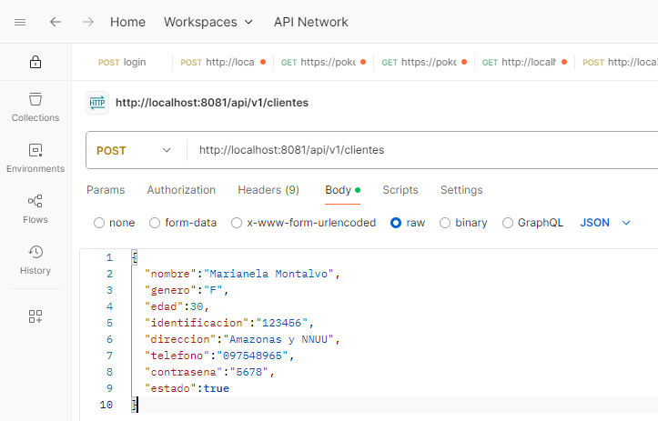

# CUENTA-SERVICE

## CAMANDOS MAVEN

> - **Limpiar dependencias:**

```
        mvn dependency:purge-local-repository -DreResolve=false
```

> - **Recompilar:**

```
        mvn clean package
```

> - **Limpiar cache:**

```
        mvn clean
```

> - **Ejecutar**:

```
        mvn clean spring-boot:run
```

## EJECUTAR

1. Ingresar al directorio [cuenta-service](./cuenta-service/) por consola
2. Ejecutar

```
    mvn clean package

    <!-- DESARROLLO -->
    mvn spring-boot:run -D spring-boot.run.profiles=dev

    <!-- PRODUCCION -->
    mvn spring-boot:run
```

## PRUEBAS

Para las pruebas se uso Postman.
Las solicitudes se las realiza con: Body / raw / json



### ENDPOINTS

> - **POST**: http://localhost:8081/api/v1/clientes

> > - Request:

```
{
  "nombre":"Marianela Montalvo",
  "genero":"F",
  "edad":30,
  "identificacion":"123456",
  "direccion":"Amazonas y NNUU",
  "telefono":"097548965",
  "contrasena":"5678",
  "estado":true
}
```

> > - Response:

```
{
    "persona": {
        "id": 6,
        "nombre": "Marianela Montalvo",
        "genero": "F",
        "edad": 30,
        "identificacion": "123456",
        "direccion": "Amazonas y NNUU",
        "telefono": "097548965"
    },
    "personaId": null,
    "estado": true
}
```

> - **GET (All)**: http://localhost:8081/api/v1/clientes

> > - Request:

```

```

> > - Response:

```
[
    {
        "persona": {
            "id": 5,
            "nombre": "Jose Lema",
            "genero": "M",
            "edad": 30,
            "identificacion": null,
            "direccion": null,
            "telefono": null
        },
        "personaId": null,
        "estado": null
    },
    {
        "persona": {
            "id": 6,
            "nombre": "Marianela Montalvo",
            "genero": "F",
            "edad": 30,
            "identificacion": null,
            "direccion": null,
            "telefono": null
        },
        "personaId": null,
        "estado": null
    }
]
```

> - **GET (BY ID)**: http://localhost:8081/api/v1/clientes/6 (id)

> > - Request:

```

```

> > - Response:

```
{
    "persona": {
        "id": 6,
        "nombre": "Marianela Montalvo",
        "genero": "F",
        "edad": 30,
        "identificacion": "123456",
        "direccion": "Amazonas y NNUU",
        "telefono": "097548965"
    },
    "personaId": null,
    "estado": true
}
```

> - **PUT**: http://localhost:8081/api/v1/clientes/6 (id)

> > - Request:

```
{
  "nombre":"Marianela Montalvo",
  "genero":"F",
  "edad":25,
  "identificacion":"785496",
  "direccion":"Amazonas y NNUU",
  "telefono":"097548965",
  "contrasena":"5678",
  "estado":true
}
```

> > - Response:

```
{
    "persona": {
        "id": 6,
        "nombre": "Marianela Montalvo",
        "genero": "F",
        "edad": 25,
        "identificacion": "785496",
        "direccion": "Amazonas y NNUU",
        "telefono": "097548965"
    },
    "personaId": null,
    "estado": true
}
```

> - **DELETE**: http://localhost:8081/api/v1/clientes/5 (id)

> > - Request:

```

```

> > - Response:

```
204 No Content
```

[**REGRESAR**](../README.md)
