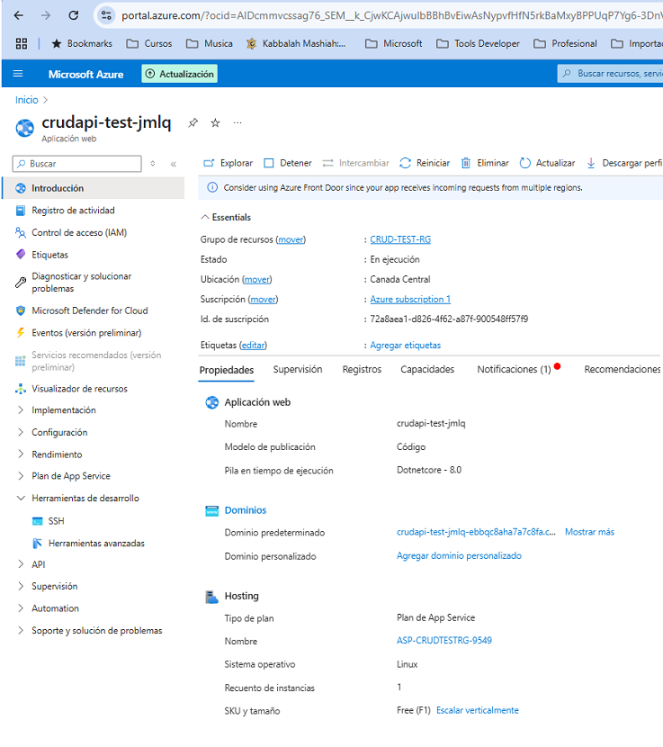

## CREAR SOLUCION

**NOTA**: Se usa dotnet 8

```
dotnet new globaljson --sdk-version 8.0.401 --force

dotnet new sln --name jmlq.nttdata.test

dotnet new classlib -o src/jmlq.nttdata.test.Domain   --name jmlq.nttdata.test.Domain
dotnet sln add .\src\jmlq.nttdata.test.Domain\jmlq.nttdata.test.Domain.csproj

dotnet new classlib -o src/jmlq.nttdata.test.Persistence   --name jmlq.nttdata.test.Persistence
dotnet sln add .\src\jmlq.nttdata.test.Persistence\jmlq.nttdata.test.Persistence.csproj


dotnet add .\src\jmlq.nttdata.test.Persistence\jmlq.nttdata.test.Persistence.csproj reference .\src\jmlq.nttdata.test.Domain\jmlq.nttdata.test.Domain.csproj


cd .\src\jmlq.nttdata.test.Persistence\
dotnet add package Microsoft.EntityFrameworkCore --version 7.0.0
dotnet add package Microsoft.EntityFrameworkCore.Design --version 7.0.0
dotnet add package Microsoft.EntityFrameworkCore.Tools --version 7.0.0
dotnet add package Microsoft.AspNetCore.Identity.EntityFrameworkCore --version 7.0.0
dotnet add package Npgsql.EntityFrameworkCore.PostgreSQL --version 7.0.0
dotnet add package Bogus (Crear data de prueba)
dotnet add package Newtonsoft.Json

cd..
cd..

dotnet new classlib -o src/jmlq.nttdata.test.Application   --name jmlq.nttdata.test.Application
dotnet sln add .\src\jmlq.nttdata.test.Application\jmlq.nttdata.test.Application.csproj

 dotnet add .\src\jmlq.nttdata.test.Application\jmlq.nttdata.test.Application.csproj reference .\src\jmlq.nttdata.test.Domain\jmlq.nttdata.test.Domain.csproj
dotnet add .\src\jmlq.nttdata.test.Application\jmlq.nttdata.test.Application.csproj reference .\src\jmlq.nttdata.test.Persistence\jmlq.nttdata.test.Persistence.csproj

cd .\src\jmlq.nttdata.test.Application\

dotnet add package FluentValidation.AspNetCore
dotnet add package AutoMapper

cd..
cd..

dotnet new webapi -o src/jmlq.nttdata.test.WebApi   --name jmlq.nttdata.test.WebApi
dotnet sln add .\src\jmlq.nttdata.test.WebApi\jmlq.nttdata.test.WebApi.csproj


dotnet add .\src\jmlq.nttdata.test.WebApi\jmlq.nttdata.test.WebApi.csproj  reference .\src\jmlq.nttdata.test.Application\jmlq.nttdata.test.Application.csproj

cd .\src\jmlq.nttdata.test.WebApi\
dotnet add package Microsoft.EntityFrameworkCore.Design --version 7.0.0

cd..
cd..

dotnet new classlib -o src/jmlq.nttdata.test.Infrastucture   --name jmlq.nttdata.test.Infrastucture
dotnet sln add .\src\jmlq.nttdata.test.Infrastucture\jmlq.nttdata.test.Infrastucture.csproj

```

- Ejecutar proyecto desarrollo

```
dotnet run --project .\src\jmlq.nttdata.test.WebApi
```

- Ambiente Local

```
http://localhost:5208/swagger/index.html
```

## PUBLICAR



> - Ingresar al directorio que tiene la aplicacion web

```
jmlq.nttdata.test.WebApi
```

> - Utilizar en VSCode `pluggin Azure` para publicar (se debe ingresar credenciales)


Se despliega en [CRUD TEST](https://crudapi-test-jmlq-ebbqc8aha7a7c8fa.canadacentral-01.azurewebsites.net/swagger/index.html)
