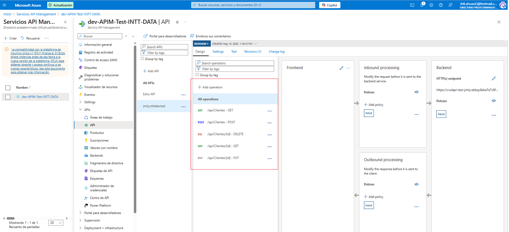

## CREAR SOLUCION

**NOTA**: Se usa dotnet 8

```
dotnet new globaljson --sdk-version 8.0.401 --force

dotnet new sln --name jmlq.nttdata.test

dotnet new classlib -o src/jmlq.nttdata.test.Domain   --name jmlq.nttdata.test.Domain
dotnet sln add .\src\jmlq.nttdata.test.Domain\jmlq.nttdata.test.Domain.csproj

dotnet new classlib -o src/jmlq.nttdata.test.Persistence   --name jmlq.nttdata.test.Persistence
dotnet sln add .\src\jmlq.nttdata.test.Persistence\jmlq.nttdata.test.Persistence.csproj


dotnet add .\src\jmlq.nttdata.test.Persistence\jmlq.nttdata.test.Persistence.csproj reference .\src\jmlq.nttdata.test.Domain\jmlq.nttdata.test.Domain.csproj


cd .\src\jmlq.nttdata.test.Persistence\
dotnet add package Microsoft.EntityFrameworkCore --version 7.0.0
dotnet add package Microsoft.EntityFrameworkCore.Design --version 7.0.0
dotnet add package Microsoft.EntityFrameworkCore.Tools --version 7.0.0
dotnet add package Microsoft.AspNetCore.Identity.EntityFrameworkCore --version 7.0.0
dotnet add package Npgsql.EntityFrameworkCore.PostgreSQL --version 7.0.0
dotnet add package Bogus (Crear data de prueba)
dotnet add package Newtonsoft.Json

cd..
cd..

dotnet new classlib -o src/jmlq.nttdata.test.Application   --name jmlq.nttdata.test.Application
dotnet sln add .\src\jmlq.nttdata.test.Application\jmlq.nttdata.test.Application.csproj

 dotnet add .\src\jmlq.nttdata.test.Application\jmlq.nttdata.test.Application.csproj reference .\src\jmlq.nttdata.test.Domain\jmlq.nttdata.test.Domain.csproj
dotnet add .\src\jmlq.nttdata.test.Application\jmlq.nttdata.test.Application.csproj reference .\src\jmlq.nttdata.test.Persistence\jmlq.nttdata.test.Persistence.csproj

cd .\src\jmlq.nttdata.test.Application\

dotnet add package FluentValidation.AspNetCore
dotnet add package AutoMapper

cd..
cd..

dotnet new webapi -o src/jmlq.nttdata.test.WebApi   --name jmlq.nttdata.test.WebApi
dotnet sln add .\src\jmlq.nttdata.test.WebApi\jmlq.nttdata.test.WebApi.csproj


dotnet add .\src\jmlq.nttdata.test.WebApi\jmlq.nttdata.test.WebApi.csproj  reference .\src\jmlq.nttdata.test.Application\jmlq.nttdata.test.Application.csproj

cd .\src\jmlq.nttdata.test.WebApi\
dotnet add package Microsoft.EntityFrameworkCore.Design --version 7.0.0

cd..
cd..

dotnet new classlib -o src/jmlq.nttdata.test.Infrastucture   --name jmlq.nttdata.test.Infrastucture
dotnet sln add .\src\jmlq.nttdata.test.Infrastucture\jmlq.nttdata.test.Infrastucture.csproj

```

- Ejecutar proyecto desarrollo

```
dotnet run --project .\src\jmlq.nttdata.test.WebApi
```

- Ambiente Local

```
http://localhost:5208/swagger/index.html
```

## PUBLICAR


> - Ingresar al directorio que tiene la aplicacion web

```
jmlq.nttdata.test.WebApi
```

> - Utilizar en VSCode `pluggin Azure` para publicar (se debe ingresar credenciales)


Se despliega en [CRUD TEST](https://crudapi-test-jmlq-ebbqc8aha7a7c8fa.canadacentral-01.azurewebsites.net/swagger/index.html)

## F10 - CREAR APIM

### Configurar APIM:


> - Se está implementando APIM:


> - VSCode instalar si no se encuentra instalado:

```
        Swashbuckle.AspNetCore
```

> - Configurar Swagger en [Program](./src/jmlq.nttdata.test.WebApi/Program.cs)

```
// 1) Registrar servicios de Swagger/OpenAPI
builder.Services.AddEndpointsApiExplorer(); // Genera metadatos de endpoints
builder.Services.AddSwaggerGen(
    c => c.SwaggerDoc("v1", new OpenApiInfo
    {
        Title = "jmlq.nttdata.test",
        Version = "v1",
        Description = "API para la prueba técnica de NTT Data"
    })
);
```

```
// Expone el JSON en GET /swagger/v1/swagger.json.
app.UseSwagger();
// Te da una consola interactiva en /index.html
app.UseSwaggerUI(
    c =>
    {
        c.SwaggerEndpoint("/swagger/v1/swagger.json", "jmlq.nttdata.test v1");
        c.RoutePrefix = string.Empty;  // Swagger UI en la raíz (ej: http://localhost:5000/index.html)
    }
);
```

> - Ejecutar la `web.Api` abrir json de swagger

```
    http://localhost:5208/swagger/v1/swagger.json
```

> - Guardar el contenido en un archivo openapi.json (o [.yaml](../assets/openapi.yaml))

### Importar especificación en Azure API Management

> - Dentro de `Servicios API Management` -> menú lateral APIs -> botón add API.


> - Seleccionar `OpenAPI`.

> - En `OpenAPI specification` elegir `OpenAPI file` y subir el [`openapi.json`](../assets/openapi.json) o `openapi.yaml`

> - Completar:

```
Display name: Clientes-CRUD

Name (API ID): clientes-crud

Web service URL: https://crudapi-test-jmlq-ebbqc8aha7a7c8fa.canadacentral-01.azurewebsites.net

API URL suffix: clientes
```


> - Dar clic en `Crear`. Azure generará automáticamente todas las operaciones (GET, POST, PUT, DELETE).



> - Validar api en Postman. `GET:` `https://crudapi-test-jmlq-ebbqc8aha7a7c8fa.canadacentral-01.azurewebsites.net/api/clientes`


## F12: Añadir autenticación por suscripción de APIM

> - En el portal de Azure ve a tu API Management → menú lateral Productos


> - Seleccionar (o crear) un producto, por ejemplo Starter o Standard.

> > - **Crear Nuevo**


> > - **Usar Started**

> - Marcar la casilla “Requiere suscripción” (Require subscription).

> - En la sección APIs, añade tu API clientes-crud.

> - Guarda los cambios.

## F13: Mediante Políticas Inbound y Outbound de APIM eliminar un campo a elección de la trama original de Request.

> - Abrir la configuración de políticas del API en: API Management > APIs, seleccionar API (clientes-crud) y dar clic en Design.


> - Pegar configuración:

```
<inbound>
    <!-- 1) Leer y parsear el body a JSON -->
    <set-variable name="payload" value='@{
        // Leemos el body como JObject
        var json = context.Request.Body.As<JObject>(preserveContent: true);
        // Eliminamos la propiedad "contrasena"
        json.Remove("contrasena");
        // Devolvemos el objeto modificado
        return json;
    }' />

    <!-- 2) Reemplazar el body original por el JSON sin "contrasena" -->
    <set-body>@( ((JObject)context.Variables["payload"]).ToString() )</set-body>

    <!-- 3) Luego invocamos el resto de políticas -->
    <base />
    <!-- …otras políticas… -->

```

**Donde**:

> > - `set-variable` lee el cuerpo como un objeto JObject.
> > - El segundo `set-variable` quita la clave "contrasena".
> > - `set-body` vuelve a escribir el JSON sin ese campo.


> - Resultado edición regla:


> - Trace


> - **Validar desde Postman**

Se usar url **APIM**: https://dev-apim-test-intt-data.azure-api.net/clientes/api/Clientes

> > - Validar Suscripcion


> > - Crear Suscripcion en Azure


> > - Enviar keys suscripcion en Postman


> > - Validar eliminar campo


